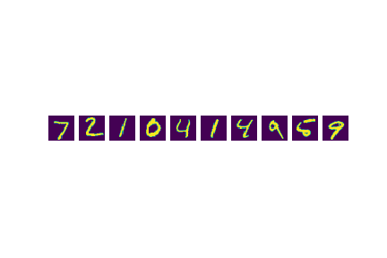
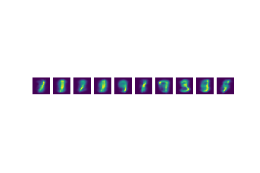
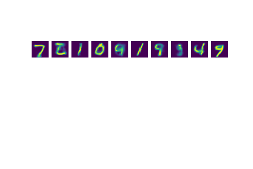
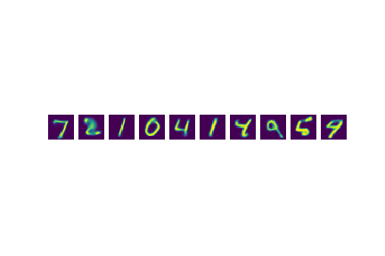
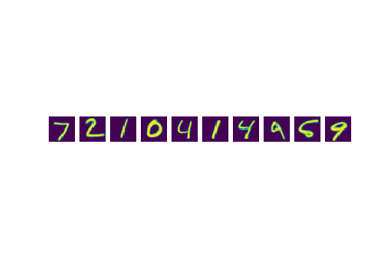

# Attentive-Neural-Process

## Description
* A pytorch implementation of [Attentive Neural Process](https://arxiv.org/abs/1901.05761).
* Simple code for generating samples with ANP.
* I will update the super-resolution experiments soon.

## Requirements
  * Install python 3
  * Install pytorch == 0.4.0

## File description
  * `preprocess.py` includes all preprocessing codes when you loads data.
  * `module.py` contains all methods, including attention, linear and so on.
  * `network.py` contains whole structure of network.
  * `train.py` is for training ANP model.
  * `generate.ipynb` is for generating samples.

## Results
test samples after 50 epoch training with random context selection.

* original 

* 10 contexts 

* 50 contexts 

* 100 contexts 

* half contexts 

## Reference
  * https://github.com/deepmind/neural-processes

## Comments
  * Any comments for the codes are always welcome.
